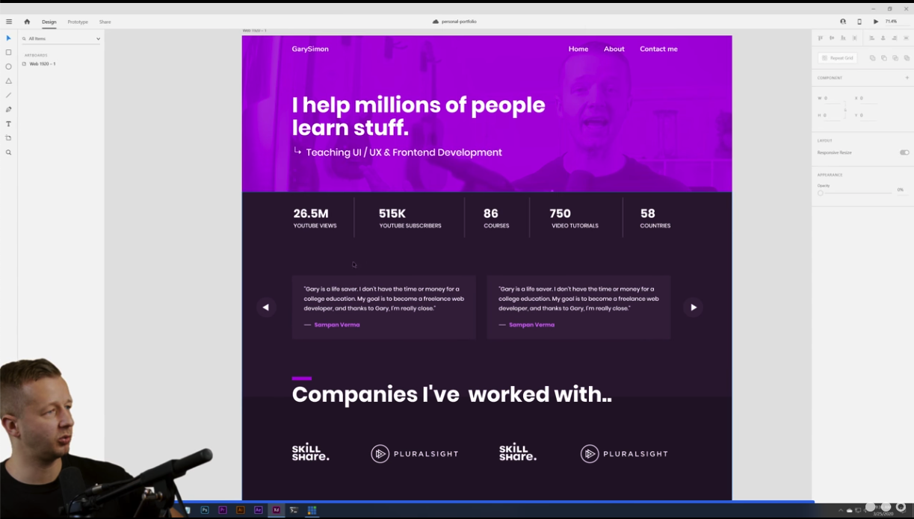
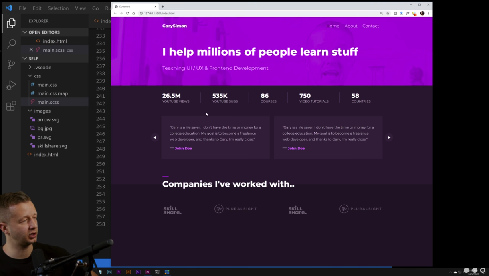

# HTML & CSS Crash Course

## Source
[HTML & CSS Crash Course - From Mockup to Product](https://www.youtube.com/watch?v=Ly6pm8UxZU4)

HTML & CSS are used hand-in-hand to build webpages across the web. I have been using html quite a bit recently so I decided it would be a good idea to learn from another source on this topic.

I believe this is a good video as a refresher for how CSS can be tied in with HTML. The instructor from _DesignCourse_ does a great job at showing the full process of designing a webpage.

## What You'll Need
1. __A Design__
    - Before you even begin to write anything in HTML or CSS you need to have a planned out design to work towards. 
2. __HTML__ 
    - This is where you will begin to build your webpage. This is the core, where you will need to place all information you wish to be shown on the webpage.
3. __CSS__
    - With CSS, you will be able to clean up how your webpage looks to viewers. This will allow for you to acheive that original deign you are going for.

# From Mockup to Product
In the tutorial, the instructor is very clear and concise on the process of beginning web development. I have used HTML and CSS many times in school, but it is a nice change of pace to learn from other sources. 

The instructor begins by showing his initial portfolio design made using Adobe XD (shown above). Then begins writing HTML and CSS to represent his design on the web. 

One thing he is using that I have not used personally is a main.scss document. This main.scss is useful because it watches your code within Visual Studio Code and "converts it automatically to CSS."

The instructor runs through his mockups, including the icons and images he is using and why. He also runs through how he sets up the HTML document before he begins adding information.

I found it extremely helpful to watch somebody write html and css live from scratch. It is also interesting to see how other's think while they are writing HTML.

It was interesting to see him write out css as well. It allowed to see into a designer go through their design process and complete their design (seen below)

Throughout the tutorial there are many tips and ticks to use when going through the process of web design.

__Top Tips and Tricks:__
- Tutorial of Navigation Bar format.
- How to divide your webpage into sections.
- How to create and manipulate lists of containers.
